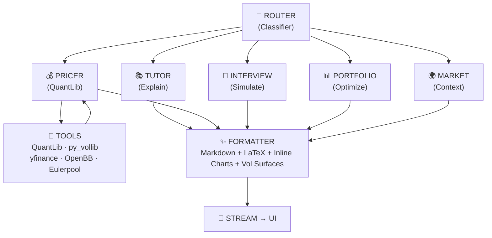
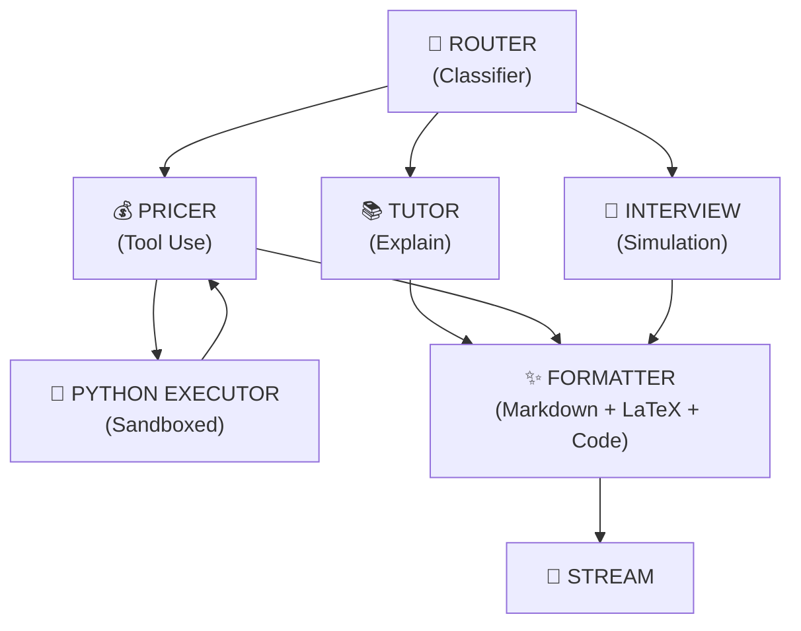

# The Bridge — StructLab

<aside>
🎯

**Salle de Contrôle** — Tu ne construis pas une app. Tu construis un Bloomberg Terminal killer avec une UX de 2026 et un cerveau d'IA. Voici les armes pour y arriver à $\$0$.

</aside>

---

# 🧬 PARTIE 1 — Le Moteur de Pricing

*C'est ici que tu passes de "chatbot finance" à "desk de structuration". Ces outils transforment The Bridge en un vrai terminal quantitatif.*

## ⚙️ QuantLib-Python — Le Saint Graal du Pricing

<aside>
💎

**100% Gratuit · BSD License · Aucune Limite**

</aside>

| **Propriété** | **Détail** |
| --- | --- |
| URL | [quantlib.org](http://quantlib.org) · `pip install QuantLib` |
| Ce que ça fait | **TOUT.** Options vanille, exotiques, barriers, asiatiques, autocalls, swaps, bonds, yield curves |
| DX | 🟡 Principal Engineer — courbe d'apprentissage raide mais documentation excellente |

### Pourquoi c'est game-changing

- Écrit en **C++** avec un clean object model, exporté en Python, R, C#, Java
- Les **investment banks** et trading companies l'utilisent pour pricer des dérivés complexes et gérer le risque
- Utilisé comme **core engine** dans les robo-advisors et plateformes de trading algorithmique
- Le **Vanna-Volga Barrier Engine** re-price les barrier options en combinant ATM, 25Δ call et 25Δ put pour capturer le smile de volatilité

### Engines disponibles

- Black-Scholes-Merton Analytic
- Binomial Trees (CRR, JR, LR, Tian)
- Monte Carlo (GBM, Heston, etc.)
- Finite Differences (PDE solvers)
- Barrier options (Up/Down, In/Out, Knock-in/Knock-out)
- Asian options (Discrete/Continuous, Arithmetic/Geometric)
- **Vanna-Volga correction** pour les FX exotics
- **Heston stochastic vol** calibration

### Impact sur l'architecture

```python
# Remplace ton pricer maison par QuantLib dans le LangGraph Tool Node
@tool
def price_exotic_option(product_type: str, params: dict) -> dict:
    """QuantLib-powered pricing — même moteur que les desks de JP Morgan"""
    import QuantLib as ql
    # 200+ pricing engines disponibles
    # Précision institutionnelle, pas un jouet Monte Carlo
```

<aside>
⚡

Ton Pricer Node passe de "student Monte Carlo" à "le même moteur que les desks de structuration utilisent en production". C'est **LA** différence qui fait qu'un VP Structuring dit "ça marche" au lieu de "c'est mignon".

</aside>

## 📊 py_vollib — Implied Volatility à Vitesse Lumière

| **Propriété** | **Détail** |
| --- | --- |
| URL | [github.com/vollib/py_vollib](http://github.com/vollib/py_vollib) |
| Prix | ✅ 100% gratuit, MIT license |
| Vitesse | Orders of magnitude plus rapide grâce aux algos de **Peter Jäckel** (LetsBeRational) |
| DX | 🟢 Copy-paste |

**Pourquoi c'est crucial :** Quand ton Pricer Node doit calculer l'IV pour 500 strikes en temps réel, py_vollib le fait en **millisecondes** là où `scipy.optimize` prendrait des secondes.

## 📈 Volatility Surface Lab — SVI + Heston Calibration

| **Propriété** | **Détail** |
| --- | --- |
| URL | [github.com/XanderRobbins/Arbitrage-Free-Volatility-Surface](http://github.com/XanderRobbins/Arbitrage-Free-Volatility-Surface) |
| Prix | ✅ 100% gratuit, MIT license |
| DX | 🟡 Intermédiaire |

**Features :** Robust IV Computation (Newton-Raphson + Brent's fallback) · Static Arbitrage Checks (put-call parity, butterfly, calendar) · SVI Parameterization · Heston Calibration via COS method

**Game-changer :** Imagine le AI Tutor qui dit "Regardez la surface de vol de l'Euro Stoxx 50" et qu'un graphique 3D interactif **calibré sur des données réelles** apparaît inline. Aucun concurrent EdTech ne fait ça.

## 🔍 volvisualizer — Extraction + Visualisation de Vol Surfaces

[github.com/GBERESEARCH/volvisualizer](http://github.com/GBERESEARCH/volvisualizer) — Extraction automatique des données d'options, calcul des IVs, et génération de surfaces interactives. ✅ Gratuit, open source.

---

# 💹 PARTIE 2 — Les Données de Marché

*L'oxygène de The Bridge.*

## 🏆 OpenBB — Le Bloomberg Terminal Open Source

| **Propriété** | **Détail** |
| --- | --- |
| URL | [openbb.co](http://openbb.co) · [GitHub](https://github.com/OpenBB-finance/OpenBB) |
| Prix | ✅ 100% gratuit et open source |
| Ce que ça fait | Données actions, options, forex, crypto, macro, fondamentaux, news, sentiment |
- Plateforme **API-first** créée par Didier Lopes en 2021
- **Bring Your Own Data** : CSV, endpoints privés, RSS feeds, SEC filings
- **OpenBB Copilot** : Chat avec les données financières via LLMs

**Impact :** OpenBB devient le **data backbone** du backend. Au lieu de câbler 15 APIs différentes, tu branches OpenBB et tu as accès à tout. Intégrable dans LangGraph comme data source pour le Pricer Node.

## 📉 Eulerpool — Le "Bloomberg API" Gratuit

| **Propriété** | **Détail** |
| --- | --- |
| URL | [eulerpool.com](http://eulerpool.com) |
| Free Tier | 1 000 appels/jour, full data coverage, 15-min delay, aucune CB requise |
| Couverture | Equities (90+ exchanges), fondamentaux, fixed income, dérivés (options, futures, Greeks, IV surfaces), FX (2000+ paires), commodities, macro (200+ pays), 100+ ans d'historique |
| AI-Native | JSON typé et déterministe, supporte OpenAI function calling + MCP |

**Game-changer :** 1000 appels/jour gratuit avec Greeks, IV surfaces, yield curves. **Conçu pour les agents IA** — exactement ce que le LangGraph Pricer Node a besoin.

## 📊 yfinance — L'Arme Silencieuse

`pip install yfinance` — Options chains complètes, prix historiques, fondamentaux, dividendes. **Aucune clé API. Aucune limite officielle. 100% gratuit.** C'est ce que les quants utilisent pour prototyper.

## 🏛️ Alpha Vantage — Le Couteau Suisse Financier

[alphavantage.co](http://alphavantage.co) — Free tier : 25 req/jour avec accès à options, forex, crypto, commodities, et 50+ indicateurs techniques.

## 🏦 FRED + SEC EDGAR

- **FRED** : 500K+ séries macroéconomiques. Yield curves, taux, inflation, emploi. Gratuit, illimité.
- **SEC EDGAR** : Tous les filings de toutes les entreprises US. Gratuit, 10 req/sec, aucune clé.

---

# 🧮 PARTIE 3 — L'Arsenal Quant Open Source

*Les libs qui font la différence entre un chatbot et un desk de structuration.*

| **Bibliothèque** | **Ce que ça fait** | **Prix** | **Impact sur The Bridge** |
| --- | --- | --- | --- |
| **QuantLib-Python** | Pricing de TOUT : vanilles, exotiques, barriers, autocalls, swaps, bonds, yield curves | ✅ Gratuit BSD | Remplace ton Monte Carlo maison. Même moteur que les banques. |
| **py_vollib** | IV ultra-rapide (algo de Peter Jäckel) + Greeks | ✅ Gratuit MIT | Calcul d'IV en <1ms pour les surfaces de vol |
| **Volatility Surface Lab** | SVI fitting, Heston calibration, arbitrage checks | ✅ Gratuit MIT | Surfaces de vol arbitrage-free inline dans le chat |
| **volvisualizer** | Extraction + visualisation de vol surfaces depuis Yahoo | ✅ Gratuit | Démo visuelle killer pour les utilisateurs |
| **PyPortfolioOpt** | Optimisation de portefeuille (Mean-Variance, Black-Litterman, HRP) | ✅ Gratuit MIT | Nouveau node LangGraph : Portfolio Optimizer |
| **Riskfolio-Lib** | 30+ modèles de portefeuille, CVaR, drawdown constraints | ✅ Gratuit BSD | Risk management avancé |
| **arch** | Modèles GARCH, EGARCH, volatilité conditionnelle | ✅ Gratuit | Prévision de vol pour le Tutor Node |
| **hmmlearn** | Hidden Markov Models pour régimes de marché | ✅ Gratuit BSD | Détection de régimes bull/bear |
| **Zipline / Backtrader** | Backtesting de stratégies | ✅ Gratuit | Nouveau node : Strategy Backtester |
| **Nelson-Siegel-Svensson** | Modélisation de yield curves | ✅ Gratuit | Pricing de bonds + taux |
| **ffn** | Analyse de performance, ratios, drawdowns | ✅ Gratuit | Analytics de portefeuille |
| **empyrical** | Métriques de performance (Sharpe, Sortino, Max DD) | ✅ Gratuit | Evaluation de stratégies |
| **ta-lib** | 150+ indicateurs techniques | ✅ Gratuit | Analyse technique pour le contexte de marché |
| **pandas-ta** | Alternative pure Python à ta-lib | ✅ Gratuit | Plus facile à installer |
| **scipy.optimize** | Root finding pour IV, calibration de modèles | ✅ Gratuit | Backbone mathématique |
| **sympy** | Calcul symbolique (dérivation de formules de payoff) | ✅ Gratuit | Le Tutor peut "dériver" des formules en live |
| **Plotly / Dash** | Graphiques 3D interactifs (vol surfaces, payoff diagrams) | ✅ Gratuit MIT | Visualisation inline premium |

---

# 🏛️ PARTIE 4 — L'Architecture "Billion-Euro"

*Comment assembler tout ça.*

## Le LangGraph Transformé — De 2 Nodes à 8 Nodes



## Les 5 Nodes Qui Font La Licorne

### Node 1 : PRICER (QuantLib-powered)

```python
@tool
def price_with_quantlib(product_type: str, params: dict) -> dict:
    """Prix institutionnel via QuantLib — Vanilles, Barriers, Autocalls, Asians"""
    # QuantLib fait le calcul
    # py_vollib fait l'IV
    # Résultat: prix, Greeks, P&L profile, vol surface slice
```

### Node 2 : MARKET CONTEXT

```python
@tool
def get_market_context(underlier: str) -> dict:
    """Données réelles via yfinance + OpenBB + Eulerpool"""
    # Spot price, vol historique, options chain live
    # Yield curve actuelle (FRED)
    # News sentiment (Alpha Vantage)
```

### Node 3 : PORTFOLIO OPTIMIZER

```python
@tool
def optimize_portfolio(assets: list, constraints: dict) -> dict:
    """PyPortfolioOpt + Riskfolio-Lib"""
    # Mean-Variance, Black-Litterman, HRP
    # CVaR constraints, sector limits
    # Output: weights, efficient frontier, risk metrics
```

### Node 4 : VOL SURFACE GENERATOR

```python
@tool
def generate_vol_surface(underlier: str) -> dict:
    """yfinance + py_vollib + Volatility Surface Lab"""
    # Fetch live options chain
    # Compute IV for all strikes/expiries
    # Fit SVI, calibrate Heston
    # Return Plotly 3D surface data
```

### Node 5 : INTERVIEW SIMULATOR

```python
# Questions de type Goldman Sachs / BNP structuring interview
# L'AI joue le rôle d'un MD qui challenge
# Scoring rubric: technique, clarté, market awareness
```

---

# 🎯 PARTIE 5 — Données de Produits Structurés

## Connexor / SIX Swiss Exchange Data API

[dataapi.derivativepartners.com](http://dataapi.derivativepartners.com) — Une des seules APIs au monde qui fournit des données spécifiques aux structured products (reference data + end-of-day independent valuation). Pour le MVP : scraper les term sheets publiques des banques + utiliser cette API pour la validation.

---

# 🔧 PARTIE 6 — La Stack Complète à $\$0$

```
┌─────────────────────────────────────────────────────────────────┐
│                        THE BRIDGE v2.0                          │
├─────────────────────────────────────────────────────────────────┤
│                                                                 │
│  FRONTEND (Vercel — Gratuit)                                    │
│  ├── Next.js 15 + App Router                                   │
│  ├── Shadcn/UI + Glassmorphism custom                          │
│  ├── Plotly.js (vol surfaces 3D interactives)                  │
│  ├── KaTeX (LaTeX streaming)                                   │
│  ├── Recharts (payoff diagrams inline)                         │
│  └── E2E Streaming via ReadableStream                          │
│                                                                 │
│  BACKEND (Render — Gratuit)                                     │
│  ├── FastAPI + LangGraph (8 nodes)                             │
│  ├── QuantLib-Python (moteur de pricing institutionnel)        │
│  ├── py_vollib (IV ultra-rapide)                               │
│  ├── PyPortfolioOpt + Riskfolio-Lib (optimisation)             │
│  ├── OpenBB SDK (data backbone unifié)                         │
│  └── yfinance + FRED + SEC EDGAR (données live)               │
│                                                                 │
│  IA (Puter.js / Groq / Google AI Studio — Gratuit)             │
│  ├── GPT-5 via Puter.js (gratuit illimité pour le dev)        │
│  ├── Llama 3.3 70B via Groq (inférence ultra-rapide)          │
│  ├── Gemini 2.5 via Google AI Studio (fallback gratuit)       │
│  └── System prompt ancré + model-specific suffixes             │
│                                                                 │
│  DATA LAYER                                                     │
│  ├── Qdrant self-hosted (RAG vectoriel — illimité)             │
│  ├── Supabase (auth + user data — 50K MAU gratuit)             │
│  ├── Eulerpool (1000 calls/jour, IV surfaces, yield curves)    │
│  └── 20+ Structured Product Cards (JSON, pas embeddings)      │
│                                                                 │
│  EVAL & MONITORING                                              │
│  ├── Eval harness custom (50+ test cases pricing)              │
│  ├── Uptime Kuma (monitoring self-hosted)                      │
│  ├── Helicone (LLM observability — 100K req gratuit)          │
│  └── Plausible self-hosted (analytics)                         │
│                                                                 │
└─────────────────────────────────────────────────────────────────┘
```

---

# 🎖️ PARTIE 7 — $\$0$ vs $\$1B$

| **Feature** | **Étudiant (6.5/10)** | **Licorne (10/10)** | **Coût** |
| --- | --- | --- | --- |
| Pricing | Monte Carlo maison | **QuantLib** (même moteur que GS/JPM) | ✅ $\$0$ |
| IV Calculation | `scipy.optimize` lent | **py_vollib** (Peter Jäckel, <1ms) | ✅ $\$0$ |
| Vol Surface | Aucune | **SVI + Heston calibrés, 3D interactif** | ✅ $\$0$ |
| Market Data | Hardcodé / mock | **OpenBB + yfinance + Eulerpool (live)** | ✅ $\$0$ |
| Portfolio Opt | Aucun | **PyPortfolioOpt + Riskfolio-Lib** | ✅ $\$0$ |
| Yield Curves | Aucune | **FRED + Nelson-Siegel-Svensson** | ✅ $\$0$ |
| Streaming | ❌ Buffered JSON | **E2E SSE pipe-through** | ✅ $\$0$ |
| LangGraph | 2 nodes | **8 nodes avec tool-calling** | ✅ $\$0$ |
| RAG | Cosine naïf | **Hybrid (Dense+Sparse) + Cross-Encoder** | ✅ $\$0$ |
| Inline Charts | Aucun | **Payoff diagrams + Vol surfaces dans le chat** | ✅ $\$0$ |
| AI Models | 1 modèle rate-limited | **Cascade : Groq → Gemini → Puter.js** | ✅ $\$0$ |
| Financial Terminal | Aucun | **OpenBB intégré comme data backbone** | ✅ $\$0$ |
| Eval | Aucun | **50+ test cases, pricing tolerance checks** | ✅ $\$0$ |

---

# 📋 EXÉCUTION — Plan de Guerre

## Semaine 1-2 : Streaming + QuantLib

- [ ]  Implémenter le **ReadableStream** pipe-through (P0)
- [ ]  Installer QuantLib-Python, créer les 3 premiers tools : `price_european`, `price_barrier`, `price_autocall`
- [ ]  Intégrer py_vollib pour le calcul d'IV

## Semaine 3-4 : LangGraph Expansion + Data Live

- [ ]  Ajouter les nodes Pricer, Market Context, Vol Surface Generator
- [ ]  Brancher yfinance + OpenBB pour les données live
- [ ]  Brancher FRED pour les yield curves en temps réel

## Semaine 5-6 : RAG + Vol Surfaces

- [ ]  Hybrid search dans Qdrant (dense + sparse)
- [ ]  20 Structured Product Cards en JSON
- [ ]  Cross-encoder reranking (`ms-marco-MiniLM-L-6-v2`)
- [ ]  Inline vol surface 3D (Plotly) dans le chat

## Semaine 7-8 : Polish Billion-Euro

- [ ]  Streaming cursor glassmorphism
- [ ]  LaTeX crystallization animation
- [ ]  Inline payoff diagrams
- [ ]  Portfolio Optimizer Node
- [ ]  Eval harness avec 50 test cases

---

# 💎 Le Mot de la Fin — L'Arsenal

<aside>
🚀

Le marché de l'EdTech finance est **vide**. Les competitors sont des PDFs, des textbooks, et des formations PowerPoint à 5000€. **Personne** n'a un AI-powered structured products desk avec pricing réel, vol surfaces live, et interview simulation.

Avec l'arsenal ci-dessus — **tout gratuit** — tu as :

- **QuantLib** = le même moteur que les desks de structuration de Goldman Sachs
- **OpenBB** = le même data backbone qu'un Bloomberg Terminal
- **py_vollib** = le même algo d'IV que les market makers utilisent
- **Puter.js** = GPT-5 et Claude gratuitement pour le cerveau IA

Le gap entre "projet étudiant" et "licorne" n'est pas l'argent. C'est l'assemblage. Et maintenant tu as le plan d'assemblage.

</aside>

---

---

# 🏛️ PRINCIPAL ARCHITECT'S REVIEW

<aside>
⚖️

**Executive Verdict — Current Score: 6.5/10**

The vision is Tier 1. The execution is Tier 2. The gap between those two tiers is not talent — it's architectural debt accumulated from moving fast. Below is the blueprint to close that gap.

</aside>

---

## PHASE 1 : Structural Audit

### 1.1 — The Monorepo Lie

<aside>
🔴

**Diagnosis:** You don't have a monorepo. You have two projects sharing a Git repository.

</aside>

A real monorepo implies shared tooling, coordinated builds, and dependency graph awareness (Turborepo, Nx, Bazel). What you have is a directory layout:

```
/ (root) ← Vercel reads this as a Next.js project
├── backend/   ← Render reads this as a Python project
├── src/       ← Next.js app source
├── package.json
└── requirements.txt (probably duplicated or at backend level)
```

#### Problems this creates

1. **Vercel build pollution.** Every `git push` triggers a Vercel build. Change a docstring in `backend/app/main.py`, Vercel rebuilds. Burning build minutes on no-ops unless you have `git diff --quiet HEAD^ HEAD -- src/` set.
2. **Render's root directory config.** Fragile. `render.yaml` and `requirements.txt` must be perfectly aligned. Path-relative imports in Python can break if Render's build context isn't set correctly.
3. **No shared contracts.** The most dangerous problem. `src/app/api/chat/route.ts` and `backend/app/main.py` communicate via HTTP with **no shared type definition or schema**. If you change the SSE event format in Python, TypeScript has no idea. You discover it at runtime, in production.

#### The Fix

**Option A (Pragmatic):** Keep the layout, but add discipline.

- Add a `/contracts` directory at root with JSON Schema or OpenAPI specs that both sides validate against
- Add a `turbo.json` to define the dependency graph: `backend/**` → deploy Render, `src/**` → deploy Vercel
- Add path-filtered GitHub Actions or Vercel Ignored Build Step

**Option B (Correct, for v2.0):** Split into two repositories. Use a shared npm/PyPI package for contracts.

<aside>
💡

**Recommendation:** Option A now. Option B at scale (>3 contributors or >$\$1k$ MRR).

</aside>

### 1.2 — The Proxy Paradox: Killing Your Own Stream

<aside>
🚨

**This is the single largest architectural mistake in the current system.**

</aside>

#### What's happening

```
[User types] → [Browser fetch('/api/chat')] → [Next.js API Route] → [HTTP to Render /stream]
                                                      ↓
                                              Collects ALL SSE chunks
                                              Concatenates into string
                                              Returns NextResponse.json({ content: fullText })
                                                      ↓
                                              [Browser receives complete JSON]
                                              [UI renders all at once]
```

| **Metric** | **With Streaming** | **Your Current Setup** |
| --- | --- | --- |
| Time to First Token | ~200ms | 3-15 seconds (full generation) |
| Perceived Latency | Near-instant | "Is it broken?" |
| Memory on Edge Function | O(chunk) | O(full_response) |
| Timeout Risk | Low | **High** (Vercel: 10s default, 60s max Pro) |
| UX Quality | Bloomberg-tier | Student project |

#### The Master Fix — E2E Streaming

**Step 1: The Next.js API Route becomes a transparent pipe.**

```tsx
// src/app/api/chat/route.ts
export async function POST(req: Request) {
  const body = await req.json();

  const backendResponse = await fetch(`${ORCHESTRATOR_URL}/stream`, {
    method: 'POST',
    headers: {
      'Content-Type': 'application/json',
      'Authorization': `Bearer ${ORCHESTRATOR_SECRET}`,
    },
    body: JSON.stringify(body),
  });

  // DO NOT collect. DO NOT buffer. Just pipe.
  return new Response(backendResponse.body, {
    headers: {
      'Content-Type': 'text/event-stream',
      'Cache-Control': 'no-cache',
      'Connection': 'keep-alive',
    },
  });
}
```

**Step 2: The frontend consumes the stream with a proper parser.**

```tsx
// hooks/useStreamingChat.ts
export function useStreamingChat() {
  const [content, setContent] = useState('');
  const [isStreaming, setIsStreaming] = useState(false);

  const sendMessage = useCallback(async (message: string) => {
    setContent('');
    setIsStreaming(true);

    const response = await fetch('/api/chat', {
      method: 'POST',
      body: JSON.stringify({ message }),
    });

    const reader = response.body!.getReader();
    const decoder = new TextDecoder();

    let buffer = '';
    while (true) {
      const { done, value } = await reader.read();
      if (done) break;

      buffer += decoder.decode(value, { stream: true });
      const lines = buffer.split('\n');
      buffer = lines.pop() || '';

      for (const line of lines) {
        if (line.startsWith('data: ')) {
          const data = line.slice(6);
          if (data === '[DONE]') continue;
          try {
            const parsed = JSON.parse(data);
            setContent(prev => prev + (parsed.token || parsed.content || ''));
          } catch {
            setContent(prev => prev + data);
          }
        }
      }
    }
    setIsStreaming(false);
  }, []);

  return { content, isStreaming, sendMessage };
}
```

**Step 3:** Your Glassmorphism UI stays almost identical — just receives a progressively-growing string instead of a complete one. Glass panel grows as text streams in.

**Step 4:** Add a `<StreamingMarkdown />` wrapper. Debounce re-renders of KaTeX — only parse the latest paragraph.

<aside>
⚡

**Latency saved: 3-12 seconds on every single interaction.** This alone moves you from 6.5 to 7.5.

</aside>

### 1.3 — LangGraph: From Toy Graph to Production Engine

**Current State:**

```
START → Router Node → Tutor Node → END
         (classifies)   (generates)
```

**Target State — The Structuring Desk Graph:**



#### The Pricer Node — Your Killer Feature

```python
# backend/app/graph/nodes/pricer.py
from langchain_core.tools import tool
import numpy as np

@tool
def price_european_option(
    spot: float, strike: float, vol: float,
    rate: float, maturity: float, option_type: str = "call",
    n_simulations: int = 100_000
) -> dict:
    """Price a European option using Monte Carlo simulation (GBM)."""
    dt = maturity
    Z = np.random.standard_normal(n_simulations)
    ST = spot * np.exp((rate - 0.5 * vol**2) * dt + vol * np.sqrt(dt) * Z)

    if option_type == "call":
        payoffs = np.maximum(ST - strike, 0)
    else:
        payoffs = np.maximum(strike - ST, 0)

    price = np.exp(-rate * maturity) * np.mean(payoffs)
    std_error = np.exp(-rate * maturity) * np.std(payoffs) / np.sqrt(n_simulations)

    return {
        "price": round(price, 4),
        "std_error": round(std_error, 6),
        "method": "Monte Carlo GBM",
        "simulations": n_simulations
    }

@tool
def price_autocall(
    spot: float, barriers: list[float], coupons: list[float],
    observation_dates: list[float], vol: float, rate: float,
    n_simulations: int = 50_000
) -> dict:
    """Price a Phoenix Autocall with discrete barriers and coupon memory."""
    # Full implementation with path-dependent simulation
    ...
```

#### LangGraph Wiring

```python
# backend/app/graph/graph.py
from langgraph.graph import StateGraph, MessagesState
from langgraph.prebuilt import ToolNode

tools = [price_european_option, price_autocall]
tool_node = ToolNode(tools)

def router(state: MessagesState) -> str:
    last_message = state["messages"][-1]
    if last_message.tool_calls:
        return "tools"
    if needs_pricing(last_message.content):
        return "pricer"
    return "tutor"

graph = StateGraph(MessagesState)
graph.add_node("router", router_node)
graph.add_node("tutor", tutor_node)
graph.add_node("pricer", pricer_node)
graph.add_node("tools", tool_node)
graph.add_node("formatter", formatter_node)

graph.add_conditional_edges("router", router, {
    "tutor": "tutor",
    "pricer": "pricer",
})
graph.add_conditional_edges("pricer", check_tool_calls, {
    "tools": "tools",
    "formatter": "formatter",
})
graph.add_edge("tools", "pricer")
graph.add_edge("tutor", "formatter")
graph.add_edge("formatter", END)
```

<aside>
💎

This transforms the AI from "a chatbot that knows finance" to "a junior structurer with a pricing terminal." That's the product differentiator.

</aside>

---

## PHASE 2 : Optimization & Performance

### 2.1 — The LLM Cascade: Persona Stability

**Problem:** Llama 3.3 70B and Gemini 1.5 Flash have fundamentally different personalities. Rate-limiting mid-session = talking to a different person = immersion destroyed.

**Fix — Three-Layer Prompt Architecture:**

```python
SYSTEM_ANCHOR = """You are a Senior Equity Derivatives Structurer at a Tier-1
investment bank (think J.P. Morgan, Goldman Sachs, BNP Paribas). You have 15 years
of experience structuring exotic options for institutional clients.

ABSOLUTE RULES:
1. You NEVER say "I'm an AI" or "As a language model."
2. You use precise terminology: "the underlier", "knock-in barrier", "autocall trigger"
3. When explaining a product, you ALWAYS ground it in:
   (a) Client need, (b) Market view, (c) Payoff mechanics, (d) Risk/Greek profile
4. You think in P&L. Every explanation ties back to: who is long what risk, and why.
5. You push back on imprecise questions.

FORMATTING:
- Use LaTeX for ALL mathematical expressions
- Structure complex explanations with ### headers
- Always provide the payoff formula when discussing a product
"""

MODEL_SPECIFIC_SUFFIX = {
    "llama": "\nYou are concise and quantitative. Prefer formulas over prose.",
    "gemini": "\nYou are thorough and pedagogical. Explain step-by-step but maintain technical depth."
}
```

**Additionally — Prompt Versioning:**

```python
# backend/app/llm/prompts.py
PROMPT_REGISTRY = {
    "system_v3.2": SYSTEM_ANCHOR,  # Current production
    "system_v3.1": SYSTEM_ANCHOR_OLD,  # Rollback target
}
```

Every production prompt should be versioned. A/B testable. Rollbackable. Table stakes for any AI product.

### 2.2 — RAG: From Naive Retrieval to Precision Recall

**Current State (inferred):** Embed docs → cosine similarity → stuff top-k into prompt. This fails for structured products because:

1. **Semantic overlap:** Phoenix Autocall vs Athena Autocall — nearly identical descriptions, critically different barriers
2. **Tabular data:** Payoff schedules are tables. Embeddings destroy tabular structure.
3. **No metadata filtering:** "autocalls with memory coupons" needs product type filter *before* semantic search

#### The Fix — Hybrid Search + Reranking

```python
# backend/app/rag/retriever.py
from qdrant_client.models import Filter, FieldCondition, MatchValue

class HybridRetriever:
    def __init__(self, qdrant_client, collection_name: str):
        self.client = qdrant_client
        self.collection = collection_name

    async def retrieve(self, query: str, product_type: str = None, top_k: int = 10) -> list:
        # Stage 1: Metadata pre-filter
        query_filter = None
        if product_type:
            query_filter = Filter(
                must=[FieldCondition(key="product_type", match=MatchValue(value=product_type))]
            )

        # Stage 2: Dense vector search (semantic)
        dense_results = self.client.search(
            collection_name=self.collection,
            query_vector=embed(query),
            query_filter=query_filter,
            limit=top_k,
        )

        # Stage 3: Sparse vector search (BM25/keyword)
        sparse_results = self.client.search(
            collection_name=self.collection,
            query_vector=sparse_embed(query),
            query_filter=query_filter,
            limit=top_k,
            using="sparse"
        )

        # Stage 4: Reciprocal Rank Fusion
        fused = reciprocal_rank_fusion(dense_results, sparse_results, k=60)

        # Stage 5: Cross-encoder reranking
        reranked = cross_encoder_rerank(query, fused[:20])

        return reranked[:5]
```

**Cross-encoder:** `cross-encoder/ms-marco-MiniLM-L-6-v2` — 22MB, <50ms.

#### Structured Product Cards

```json
{
  "product_type": "phoenix_autocall",
  "name": "Phoenix Autocall with Memory Coupon",
  "barriers": {
    "autocall_trigger": "100% of initial",
    "coupon_barrier": "70% of initial",
    "knock_in_put": "60% of initial"
  },
  "coupon": "8% p.a., paid if above coupon barrier",
  "memory": true,
  "observation_frequency": "quarterly",
  "payoff_formula": "...",
  "greeks_profile": "Short vol, short skew, long autocall probability",
  "typical_client": "Private bank seeking yield enhancement"
}
```

Embed both the raw text AND the structured card. Inject the card as a **formatted reference table**, not embedding-reconstructed prose.

---

## PHASE 3 : UX & Premium Aesthetics

### 3.1 — Streaming Cursor with Glassmorphism Glow

```css
@keyframes structPulse {
  0%, 100% {
    opacity: 1;
    box-shadow: 0 0 8px rgba(99, 179, 237, 0.4);
  }
  50% {
    opacity: 0.3;
    box-shadow: 0 0 20px rgba(99, 179, 237, 0.8);
  }
}

.streaming-cursor {
  display: inline-block;
  width: 2px;
  height: 1.1em;
  background: linear-gradient(180deg, #63b3ed, #4299e1);
  border-radius: 1px;
  animation: structPulse 1.2s ease-in-out infinite;
  vertical-align: text-bottom;
  margin-left: 1px;
}
```

Same way a Bloomberg terminal's blinking cursor on a FLDS screen signals liveness.

### 3.2 — Mathematical Expression "Crystallization"

```css
@keyframes crystallize {
  from {
    opacity: 0;
    transform: scale(0.95);
    filter: blur(2px);
  }
  to {
    opacity: 1;
    transform: scale(1);
    filter: blur(0);
  }
}

.katex-display {
  animation: crystallize 0.3s cubic-bezier(0.4, 0, 0.2, 1) forwards;
}
```

Formulas feel like they're materializing on a glass surface. This is *premium*.

### 3.3 — Payoff Diagram Snap-On Interaction

```tsx
// components/InlinePayoff.tsx
function InlinePayoff({ product, strikes }: PayoffProps) {
  const [hoverSpot, setHoverSpot] = useState<number | null>(null);

  return (
    <div className="inline-payoff-card">
      <ResponsiveContainer width="100%" height={160}>
        <LineChart onMouseMove={(e) => setHoverSpot(e?.activeLabel)}>
          <Line type="stepAfter" dataKey="payoff" stroke="#4299e1" strokeWidth={2} dot={false} />
          {hoverSpot && (
            <ReferenceDot x={hoverSpot} y={getPayoff(hoverSpot, product, strikes)}
                          r={4} fill="#63b3ed" stroke="white" />
          )}
        </LineChart>
      </ResponsiveContainer>
      {hoverSpot && (
        <div className="payoff-tooltip glass-panel">
          S = {hoverSpot} → P&L = {getPayoff(hoverSpot, product, strikes).toFixed(2)}
        </div>
      )}
    </div>
  );
}
```

Inline, contextual, embedded in the conversation. No other EdTech platform does this.

---

## PHASE 4 : Scaling to 10/10

### 4.1 — Evaluation & Guardrails

```python
# backend/tests/eval/test_structuring_knowledge.py
EVAL_CASES = [
    {
        "query": "Explain the convexity adjustment for a variance swap",
        "must_contain": ["realized variance", "log returns", "1/T", "continuous monitoring"],
        "must_not_contain": ["I'm not sure", "standard deviation swap"],
        "reference_answer": "..."
    },
    {
        "query": "Price a 1Y ATM European call, S=100, vol=20%, r=5%",
        "expected_price_range": [10.2, 10.8],
        "tool_must_be_called": "price_european_option"
    }
]
```

Run this on every prompt change, every model swap, every RAG index rebuild. Goldman Sachs doesn't ship a pricing model without backtesting. You shouldn't ship an AI tutor without eval.

### 4.2 — Decouple the Hot Path

You do **not** need Kubernetes. You do **not** need microservices. That's resume-driven architecture.

What you need:

1. **Vercel** for the frontend ✅
2. **Render** for the FastAPI orchestrator ✅
3. **A dedicated compute layer for pricing** — Use a **Render Background Worker** or [**Modal.com**](http://Modal.com) serverless function. The LangGraph tool node calls this via HTTP.

```
[LangGraph Pricer Node] → HTTP → [Modal.com / Render Worker] → result → [back to graph]
```

Scale pricing independently of chat. 50 users chatting + 3 pricing autocalls = no lag.

### 4.3 — Security Audit

**Vulnerability 1:** Static bearer token (`ORCHESTRATOR_SECRET`). If it leaks — anyone burns your API quotas.

→ **Fix:** Rotate monthly. IP allowlisting on Render. Vercel encrypted env vars.

**Vulnerability 2:** No per-user rate limiting on backend.

```python
# backend/app/middleware/auth.py
from jose import jwt

async def verify_supabase_jwt(token: str) -> dict:
    payload = jwt.decode(token, SUPABASE_JWT_SECRET, algorithms=["HS256"],
                        audience="authenticated")
    return payload
```

**Vulnerability 3:** No abuse protection.

```python
from slowapi import Limiter
limiter = Limiter(key_func=get_user_id_from_jwt)

@app.post("/stream")
@limiter.limit("20/minute")
async def stream_chat(request: Request):
    ...
```

### 4.4 — The 10/10 Feature Matrix

| **Feature** | **Current** | **Target** | **Priority** |
| --- | --- | --- | --- |
| E2E Streaming | ❌ Buffered JSON | ✅ SSE pipe-through | **P0 — Do this week** |
| Tool-calling graph | ❌ 2-node toy | ✅ Router/Tutor/Pricer/Tools | **P0** |
| Eval harness | ❌ | ✅ 50+ test cases | **P1** |
| Hybrid RAG + Reranking | ❌ Naive cosine | ✅ Dense+Sparse+CrossEncoder | **P1** |
| Inline payoff diagrams | ❌ | ✅ Context-aware rendering | **P1** |
| Streaming math rendering | ❌ | ✅ Debounced KaTeX | **P1** |
| Security hardening | Partial | ✅ JWT validation, IP allow, rotation | **P1** |
| Prompt versioning | ❌ | ✅ Registry + A/B | **P2** |
| Per-user rate limiting | ❌ | ✅ JWT + SlowAPI | **P2** |
| Pricing compute isolation | ❌ | ✅ Modal/Worker | **P2** |

---

## THE MASTER PLAN — V2.0 Execution Order

<aside>
📅

**Week 1-2:** E2E Streaming. Rip out the JSON buffering. Implement the ReadableStream pipe-through. Build the `useStreamingChat` hook. **This single change transforms the UX.**

**Week 3-4:** LangGraph expansion. Add the Pricer node, the Tool node, and at least two pricing tools (European vanilla, simple autocall). Wire the conditional edges. **This is the product differentiator.**

**Week 5-6:** RAG overhaul. Hybrid search in Qdrant (dense + sparse). 20 structured product cards. Cross-encoder reranking. Eval harness with 50 test cases.

**Week 7-8:** UX polish. Streaming cursor, math crystallization, inline payoff diagrams. Security hardening: JWT validation, rate limiting, secret rotation.

**Post-launch:** Pricing compute isolation, prompt A/B testing, advanced graph nodes (interview simulator, Greeks surface generator).

</aside>

---

## Final Verdict

<aside>
💎

The Bridge has the right *vision*. It's targeting a real gap in the market — there is no high-quality, interactive training platform for equity derivatives structuring. The competitors are PDFs, outdated textbooks, and tribal knowledge locked inside bank training programs.

Your current **6.5/10** is held back by two things: **the streaming anti-pattern** (which makes the AI feel slow and dead) and **the toy LangGraph** (which limits the AI to "talking" when it should be "doing").

- Fix those two → **8/10**
- Add RAG precision layer + premium micro-interactions → **9/10**
- Add eval harness → **10/10** — because a 10/10 product isn't just good, it's *provably* good.
</aside>

---

---

# 🏗️ GOOGLE ANTIGRAVITY + GEMINI CLI

*Guide Stratégique Ultime pour The Bridge*

---

## BLOC 1 — Cartographie Réelle d'Antigravity

### 1.1 — Ce qu'Antigravity EST réellement

Google Antigravity est une plateforme de développement agentique qui combine un IDE AI-powered familier avec une interface agent-first. Elle permet de déployer des agents qui planifient, exécutent et vérifient des tâches complexes de manière autonome à travers l'éditeur, le terminal et le navigateur.

La plateforme est un fork fortement modifié de Visual Studio Code. Il y a un débat sur le fait qu'il s'agisse d'un fork direct de VS Code ou d'un fork de Windsurf.

**Les deux modes fondamentaux :**

- **Editor View** : interface IDE classique type VS Code/PyCharm avec un sidebar agent, similaire à Cursor ou GitHub Copilot
- **Manager View** : centre de contrôle pour orchestrer plusieurs agents travaillant en parallèle à travers des workspaces, permettant l'exécution asynchrone des tâches

**Modèles supportés :** Gemini 3.1 Pro, Gemini 3 Flash, Claude Sonnet 4.6, Claude Opus 4.6, GPT-OSS-120B

**Système d'Artifacts :** Les agents génèrent des livrables vérifiables (listes de tâches, plans d'implémentation, screenshots, enregistrements de navigation) plutôt que des appels d'outils bruts.

<aside>
✅

**Gratuit** en public preview, sans frais pour les individus. Compatible macOS, Windows et Linux, avec des rate limits généreux.

</aside>

### 1.2 — Les Points Forts Réels

#### A. Multi-agent parallèle — LE différenciateur

Dans le Manager View, un développeur peut dispatcher **5 agents différents** travaillant sur 5 bugs simultanément. Le système d'inbox gère les requêtes d'approbation.

<aside>
⚡

**Impact The Bridge :** Un agent travaille sur le streaming E2E, un autre sur le Pricer Node QuantLib, un troisième sur les product cards RAG. **En parallèle.** C'est le multiplicateur de vélocité pour un dev solo.

</aside>

#### B. Browser Control natif

Couplé avec Gemini 2.5 Computer Use pour le contrôle du navigateur et Nano Banana pour la génération d'images.

→ L'agent peut tester ton UI glassmorphism, vérifier les payoff diagrams inline, et prendre des screenshots comme preuve. **Pas de QA manuelle.**

#### C. Skills — Mémoire procédurale

Les Skills sont des modules de formation spécialisés qui comblent le fossé entre le modèle Gemini 3 généraliste et ton contexte spécifique. L'agent ne charge le savoir procédural lourd que quand l'intention correspond à un skill spécifique → évite le bloat d'outils.

#### D. Knowledge Items (KIs) — Mémoire persistante

Contrairement à l'historique de conversation (lié à la session), les KIs sont des faits distillés qui persistent indéfiniment. Un sous-agent de Knowledge analyse chaque conversation et extrait les informations clés. Chaque KI a : `metadata.json` + `artifacts/`. Chargées automatiquement au début de nouvelles conversations.

#### E. Workflows — Procédures pas-à-pas

Le répertoire `.agents/workflows/` supporte des guides pas-à-pas qu'Antigravity suit précisément.

- **Skills** : l'IA juge le contexte et auto-sélectionne → pour le travail nécessitant du jugement
- **Workflows** : exécutent des étapes fixes dans l'ordre → pour les procédures répétitives exactes

### 1.3 — Les Limites Réelles

#### Limites Confirmées

- Courbe d'apprentissage malgré le marketing "langage naturel"
- IDE local — ne déploie pas vers le cloud. Hébergement, CI/CD, env vars, SSL restent à configurer manuellement
- Les agents AI se concentrent sur la feature demandée, pas sur la sécurité ou la scalabilité long terme
- Retours utilisateurs mitigés : erreurs et génération lente pour certains

#### Limites pour The Bridge spécifiquement

1. **Python backend (FastAPI/LangGraph)** : Antigravity est fort pour le fullstack JS/TS. Pour du Python complexe (QuantLib, LangGraph), moins fluide. L'agent n'a pas de connaissance native de QuantLib.
2. **Streaming SSE** : L'agent pourrait ne pas comprendre les subtilités du pipe-through ReadableStream sans instructions très précises.
3. **Finance domain knowledge** : Gemini 3 est généraliste. Sans Skills et context injection massifs, il ne connaît pas les payoff structures des autocalls ou la calibration Heston.

<aside>
⚠️

**Règles anti-chaos :**

- Idéalement 1 agent par workspace pour éviter les conflits
- Max 7-10 skills installés — plus = bloat de tokens + auto-activation non pertinente
- Mode **Agent-Assisted** (pas Agent-Driven) sur un projet existant
</aside>

### 1.4 — Quand Gemini CLI est meilleur

Gemini CLI est un agent IA open source en terminal, avec une boucle ReAct + outils intégrés + MCP. **60 req/min et 1000 req/jour gratuitement** — la plus grande allocation du marché.

| **Gemini CLI > Antigravity** | **Antigravity > Gemini CLI** |
| --- | --- |
| Tâches terminal-native (scripts, CI/CD, Docker) | Tâches visuelles/UI (React, Tailwind) |
| Scripting et automatisation rapide | Multi-agent parallèle |
| Analyse rapide d'un repo (1M tokens de contexte) | Browser control (test UI) |
| Intégration CI/CD via JSON output | Refactoring multi-fichiers avec review visuelle |
| Travail headless / SSH | Longues sessions avec accumulation de KIs |

---

## BLOC 2 — Les Meilleurs Repos GitHub

### Catégorie 1 : Skills & Instructions

#### 1. `rominirani/antigravity-skills` ⭐⭐⭐⭐⭐

| **Attribut** | **Valeur** |
| --- | --- |
| URL | [github.com/rominirani/antigravity-skills](http://github.com/rominirani/antigravity-skills) |
| Catégorie | Skills / Templates / Scaffold |
| Résumé | Collection officielle Google. 5 niveaux de complexité. Copier-coller dans `~/.gemini/antigravity/skills/` |
| Maturité | 🟢 Repo officiel Google, maintenu activement |
| Recommandation | 🟢 **Usage immédiat** |

#### 2. `rmyndharis/antigravity-skills` ⭐⭐⭐⭐⭐

| **Attribut** | **Valeur** |
| --- | --- |
| URL | [github.com/rmyndharis/antigravity-skills](http://github.com/rmyndharis/antigravity-skills) |
| Catégorie | Skills avancés / Persona-based agents |
| Skills pour The Bridge | `fastapi-pro`, `async-python-patterns`, `nextjs-app-router-patterns`, `backend-architect`, `security-auditor` |
| Maturité | 🟢 Collection curatée, bien structurée |
| Recommandation | 🟢 **Usage immédiat — le repo le plus important pour toi** |

#### 3. `vercel-labs/skills` (CLI)

[github.com/vercel-labs/skills](http://github.com/vercel-labs/skills) — CLI open-source avec approche symlink pour installer, mettre à jour et supprimer des skills de manière centralisée. `npx skills add <repo> -a gemini-cli -a antigravity` — gestion unifiée. 🟢 **Usage immédiat.**

### Catégorie 2 : Agent Orchestration

#### 4. `google/adk-python`

Framework officiel Google pour construire des agents IA en Python. Compatible MCP, outils Gemini, orchestration multi-agents. 🟡 **Tester plus tard** — LangGraph est plus mature pour ton cas.

#### 5. `langchain-ai/langgraph`

Déjà intégré dans The Bridge. Antigravity ne remplace PAS LangGraph — il t'aide à **écrire** ton code LangGraph plus vite. → Créer un Skill Antigravity `langgraph-patterns`.

### Catégorie 3 : MCP / Tool Connectivity

#### 6. `modelcontextprotocol/servers`

Collection officielle de serveurs MCP : GitHub, Slack, Postgres, filesystem. Configure dans `~/.gemini/settings.json`. 🟢 **Usage immédiat — configurer GitHub + Postgres MCP.**

#### 7. `supabase/supabase-mcp`

Serveur MCP officiel Supabase. L'agent inspecte ton schéma, écrit des migrations, teste des requêtes — directement depuis le chat. 🟢 **Usage immédiat.**

### Catégorie 4 : Code Execution / Sandbox

#### 8. `e2b-dev/e2b`

Sandboxes cloud sécurisées pour exécuter du code IA. Pour le Pricer Node : QuantLib Monte Carlo en sandbox isolé. 👀 **Watchlist** — les sandboxes Antigravity natifs suffisent pour le moment.

### Catégorie 5 : RAG / LLM Gateway

#### 9. `BerriAI/litellm`

Proxy unifié pour 100+ LLMs. Gère les fallbacks, le rate limiting, et le routing automatique. **Résout ton LLM Cascade (Groq → Gemini → fallback).** 15K+ stars. 🟢 **Intégrer dans le backend.**

#### 10. `run-llama/llama_index`

Framework RAG le plus complet. Hybrid search, reranking, structured data indexing. 📚 **Étudier comme inspiration** — implémente les patterns sans la dépendance.

### Catégorie 6 : Testing / Evaluation

#### 11. `braintrustdata/autoevals`

Framework d'évaluation pour LLMs. Factuality, relevance, semantic similarity. 🟡 **Tester semaine 5-6** quand tu construis ton eval harness.

#### 12. `microsoft/playwright`

Framework de test E2E cross-browser. Tests reproductibles en CI pour le streaming UI, payoff diagrams, vol surfaces. 🟡 **Tester semaine 3.**

### Catégorie 7 : DevOps / CI/CD

#### 13. `nektos/act`

Exécute les GitHub Actions localement. Gemini CLI + `act` = teste tes pipelines sans commit. 🟡 **Tester semaine 4.**

### Catégorie 8 : Référence architecturale

#### 14. `google-gemini/gemini-cli`

Entièrement open source (Apache 2.0). Étudier l'architecture ReAct, les outils built-in, les patterns MCP. 📚 **Étudier.**

### 🏆 TOP 10 Global

| **Rang** | **Repo** | **Pourquoi** |
| --- | --- | --- |
| 1 | `rmyndharis/antigravity-skills` | Skills prêts à l'emploi : fastapi-pro, backend-architect, nextjs-app-router, security-auditor |
| 2 | `rominirani/antigravity-skills` | Ref officielle Google, 5 niveaux, patterns de base |
| 3 | `vercel-labs/skills` | CLI unifié pour gérer skills Antigravity + Gemini CLI |
| 4 | `modelcontextprotocol/servers` | MCP GitHub + Postgres + Filesystem = agent connecté |
| 5 | `BerriAI/litellm` | LLM cascade + fallbacks pour The Bridge backend |
| 6 | `supabase/supabase-mcp` | Connexion directe agent → ta DB |
| 7 | `microsoft/playwright` | Tests E2E automatisés |
| 8 | `google-gemini/gemini-cli` | Comprendre les internals pour mieux piloter |
| 9 | `langchain-ai/langgraph` | Déjà utilisé — créer des Skills pour l'enseigner à Antigravity |
| 10 | `nektos/act` | CI/CD local, itération rapide |

<aside>
⚡

**TOP 3 — Meilleur Effet de Levier Immédiat :**

1. `rmyndharis/antigravity-skills` — Installe `fastapi-pro` + `backend-architect` + `nextjs-app-router-patterns` + `security-auditor` → staff engineer spécialisé. **5 min.**
2. `vercel-labs/skills` — `npx skills add` pour synchroniser AG + CLI. **2 min.**
3. **Tes propres Skills custom** — `structlab-architecture`, `quantlib-pricing`, `structured-products-domain`. **30 min. Impact maximal.**
</aside>

---

## BLOC 3 — Matrice de Décision

| **Repo** | **Décision** | **Justification** |
| --- | --- | --- |
| `rmyndharis/antigravity-skills` | 🟢 **Intégrer maintenant** | Skills prêts : fastapi, next.js, architect, security |
| `rominirani/antigravity-skills` | 🟢 **Intégrer maintenant** | Patterns officiels pour tes skills custom |
| `vercel-labs/skills` | 🟢 **Intégrer maintenant** | 2 min de setup, unifie AG + CLI |
| `modelcontextprotocol/servers` | 🟢 **Intégrer maintenant** | GitHub MCP + Postgres MCP changent tout |
| `supabase/supabase-mcp` | 🟢 **Intégrer maintenant** | Connexion directe agent → DB |
| `BerriAI/litellm` | 🟢 **Intégrer maintenant** | Résout le LLM cascade côté backend |
| `microsoft/playwright` | 🟡 **Tester semaine 3** | Quand ton streaming UI sera en place |
| `nektos/act` | 🟡 **Tester semaine 4** | Quand tu auras des GH Actions |
| `google-gemini/gemini-cli` | 📚 **Étudier** | Comprendre les internals |
| `langchain-ai/langgraph` | ✅ **Déjà intégré** | Créer des Skills qui l'enseignent à AG |
| `google/adk-python` | 👀 **Watchlist** | Si tu migres vers l'écosystème Google |
| `e2b-dev/e2b` | 👀 **Watchlist** | Sandboxing du Pricer quand tu scales |
| `braintrustdata/autoevals` | 🟡 **Tester semaine 5** | Pour ton eval harness |
| `run-llama/llama_index` | 📚 **Étudier** | Patterns RAG à adapter, pas la lib entière |

<aside>
🎯

**Décision tranchée :** Les 6 premiers repos + tes Skills custom = **95% du gain**. Le reste est bonus. Ne te disperse pas.

</aside>

---

## BLOC 4 — Les Meilleures Instructions

### A. Master Instruction Système

Fichier : `.agent/rules.md`

```markdown
# AGENT OPERATING PROTOCOL — THE BRIDGE / STRUCTLAB

## Identity
Tu es un Staff Engineer spécialisé en Equity Derivatives Technology et
Full-Stack Engineering. Tu travailles sur THE BRIDGE — une plateforme
d'apprentissage IA pour les structured products.

## Stack
- Frontend: Next.js 15 (App Router) + TypeScript + Shadcn/UI + Tailwind + KaTeX + Recharts
- Backend: Python 3.12 + FastAPI + LangGraph + QuantLib + Qdrant
- Infra: Vercel (frontend) + Render (backend) + Supabase (auth/DB)
- AI: Groq (Llama 3.3 70B) + Google AI Studio (Gemini) + fallback cascade via LiteLLM

## Architecture
- Frontend Next.js dans `/src/`
- Backend FastAPI dans `/backend/`
- Communication via SSE streaming (Server-Sent Events)
- L'API route Next.js (`/api/chat/route.ts`) est un PIPE TRANSPARENT — NE JAMAIS buffer
- LangGraph nodes : Router, Tutor, Pricer, Tools, Formatter

## Principes NON NÉGOCIABLES

### 1. PLANIFIER AVANT D'AGIR
- Produis d'abord un PLAN sous forme d'artifact (checklist numérotée)
- Attends la validation avant de coder
- Chaque item = changement atomique, testable indépendamment

### 2. SCOPE MINIMAL
- NE MODIFIE QUE ce qui est explicitement demandé
- Problème adjacent → SIGNALE dans un artifact séparé, ne corrige pas
- Zéro modification cosmétique non demandée

### 3. ARCHITECTURE-FIRST
- Vérifie la cohérence avec l'architecture existante
- Changement de contrat API → signale AVANT d'implémenter
- NE JAMAIS créer un endpoint sans documenter son contrat

### 4. STREAMING SACRÉ
- Le streaming SSE est le flux critique — NE JAMAIS le casser ou le buffer
- Tout changement touchant au streaming DOIT être testé E2E

### 5. FINANCE DOMAIN AWARENESS
- Vocabulaire précis : "underlier", "knock-in barrier", "autocall trigger"
- Formules en LaTeX : $S_T$, $\Delta$, $\frac{\partial V}{\partial S}$
- Pricing via QuantLib — ne réimplémenter JAMAIS from scratch

### 6. ARTIFACTS & VÉRIFICATION
- Plans, diffs résumés, screenshots si UI
- Backend → montre le test exécuté et son résultat
- Frontend → décris ce que l'utilisateur verra

### 7. GESTION D'INCERTITUDE
- Propose 2-3 options classées avec tradeoffs
- Si concept financier inconnu → DIS-LE, ne hallucine pas

### 8. QUALITÉ DE CODE
- Python : type hints, docstrings, pas de `# type: ignore`
- TypeScript : strict mode, pas de `any`, interfaces pour contrats API
- Commits : Conventional Commits (`feat:`, `fix:`, `refactor:`, `docs:`)
- Tests : chaque feature backend → au moins un test pytest
```

### B. Workspace Rules

Fichier : `.agent/settings.yaml`

```markdown
# WORKSPACE RULES

## File Structure
- Frontend source: /src/app/ (Next.js App Router)
- Frontend components: /src/components/
- Frontend hooks: /src/hooks/
- API routes: /src/app/api/
- Backend entry: /backend/app/main.py
- LangGraph: /backend/app/graph/
- LangGraph nodes: /backend/app/graph/nodes/
- RAG: /backend/app/rag/
- LLM config: /backend/app/llm/
- Tests: /backend/tests/

## Dependencies
- Frontend: package.json (npm/pnpm)
- Backend: requirements.txt + pyproject.toml
- JAMAIS mélanger frontend/backend

## Environment Variables
- Frontend (.env.local): NEXT_PUBLIC_*, ORCHESTRATOR_URL, ORCHESTRATOR_SECRET
- Backend (.env): GROQ_API_KEY, GOOGLE_API_KEY, QDRANT_URL, SUPABASE_URL, SUPABASE_JWT_SECRET
- JAMAIS log ou exposer une clé API

## Git Workflow
- main = production (Vercel auto-deploy)
- dev = développement
- Feature branches: feat/<nom>, fix/<nom>
- TOUJOURS feature branch, JAMAIS directement sur main
```

### C. Task Templates — 10 Templates Opérationnels

#### Template 1 : Audit de Repo

```
TÂCHE : Audit de l'état actuel du repo

1. Lis la structure du projet (frontend + backend)
2. Identifie les dettes techniques critiques
3. Vérifie la cohérence des contrats API
4. Vérifie le streaming SSE end-to-end (pas de buffering)
5. Liste les dépendances outdated
6. Identifie les failles de sécurité évidentes
7. Produis un artifact AUDIT_REPORT.md :
   - Score global /10
   - Top 5 problèmes critiques
   - Top 5 quick wins
   - Recommandations architecturales
N'écris aucun code. Analyse uniquement.
```

#### Template 2 : Plan d'Implémentation

```
TÂCHE : Plan d'implémentation pour [FEATURE]

1. Comportement attendu (user story)
2. Fichiers modifiés
3. Nouveaux fichiers à créer
4. Changements de contrat API
5. Dépendances nouvelles
6. Ordre d'implémentation (étapes atomiques)
7. Risques et points d'attention
8. Tests à écrire

Format : artifact checklist numérotée.
Attends validation avant de coder.
```

#### Template 3 : Refactor Massif

```
TÂCHE : Refactor [COMPOSANT/MODULE]

Phase 1 — Analyse (pas de code) :
- Lis le code actuel, identifie les problèmes
- Artifact : état actuel vs état cible
- Liste chaque changement atomique

Phase 2 — Exécution (après validation) :
- Un changement à la fois
- Vérifie que les tests passent après chaque changement
- Si test casse → corrige IMMÉDIATEMENT
- Diff résumé après chaque étape

CONTRAINTE : Ne change JAMAIS le comportement observable.
```

#### Template 4 : Debug Backend

```
TÂCHE : Debug [PROBLÈME]

1. Reproduis le problème
2. Identifie la root cause (pas juste le symptôme)
3. Propose un fix avec explication du POURQUOI
4. Écris un test qui échoue AVANT le fix, réussit APRÈS
5. Vérifie que le fix ne casse rien d'autre
6. Si le bug touche au streaming → teste E2E
```

#### Template 5 : Feature Full-Stack

```
TÂCHE : Nouvelle feature full-stack [NOM]

Ordre OBLIGATOIRE :
1. Contrat API (schéma request/response) → artifact
2. Backend d'abord : endpoint + logic + test
3. Frontend ensuite : hook + composant + intégration
4. Test E2E : vérifie le flux complet
5. Documentation : met à jour l'API contract doc

NE COMMENCE PAS le frontend avant que le backend fonctionne.
```

#### Template 6 : Écriture de Tests

```
TÂCHE : Tests pour [MODULE]

1. Identifie les chemins critiques (happy path + edge cases)
2. Pour chaque chemin :
   - Nom descriptif (test_should_price_european_call_correctly)
   - Arrange / Act / Assert clair
   - Assertions précises
3. Pricing : vérifie contre Black-Scholes analytique
4. API : mock les dépendances externes
5. Lance les tests et montre les résultats
```

#### Template 7 : Optimisation Performance

```
TÂCHE : Optimiser [COMPOSANT]

1. Mesure baseline (temps de réponse, mémoire, bundle size)
2. Identifie les bottlenecks (profiling, pas de devinage)
3. Optimisations classées par impact/effort
4. Implémente une à la fois
5. Mesure après chaque changement
6. Si pas d'amélioration mesurable → revert
```

#### Template 8 : Intégration API

```
TÂCHE : Intégrer [API EXTERNE]

1. Lis la documentation
2. Endpoints nécessaires et limites (rate limiting, auth)
3. Service/client dédié (pas d'appel direct depuis les routes)
4. Gestion d'erreurs (timeout, rate limit, API down)
5. Retry avec backoff exponentiel
6. Test avec mock de l'API
7. Documente les env vars nécessaires
```

#### Template 9 : Setup DevOps

```
TÂCHE : Configuration [CI/CD / Docker / Monitoring]

1. État actuel de l'infrastructure
2. Configuration cible
3. Fichiers de configuration (Dockerfile, GH Actions)
4. Teste LOCALEMENT (utilise `act` si GH Actions)
5. Documente le processus de déploiement
```

#### Template 10 : Préparation de Release

```
TÂCHE : Préparer la release v[X.Y.Z]

1. Vérifie que tous les tests passent
2. Met à jour CHANGELOG.md
3. Vérifie les env vars production
4. Vérifie le streaming SSE en production
5. Vérifie la sécurité : secrets, CORS, rate limiting
6. Artifact RELEASE_CHECKLIST avec status vert/rouge
```

### D. Agent Operating Rules

```markdown
# RÈGLES D'OPÉRATION DES AGENTS

## Séquence obligatoire
1. COMPRENDRE — Reformule la demande
2. RECHERCHER — Lis les fichiers pertinents, consulte les KIs
3. PLANIFIER — Produis un plan (artifact checklist)
4. VALIDER — Attends l'approbation humaine
5. EXÉCUTER — Étape par étape
6. VÉRIFIER — Tests, screenshots, preuves
7. DOCUMENTER — Résumé des changements

## L'agent NE DOIT JAMAIS
- Modifier des fichiers non mentionnés dans le plan
- Reformater du code non lié à la tâche
- Ajouter des features "bonus" non demandées
- Supprimer du code "inutile" sans accord
- Changer la structure de dossiers sans discussion
- Committer directement sur main

## Communication
- Choix : options numérotées avec tradeoffs
- Bloqué : dis-le immédiatement
- Hypothèse : marque-la [HYPOTHÈSE]
- Streaming/sécurité : review obligatoire
```

### E. Context Injection Files

#### `PRODUCT.md`

```markdown
# THE BRIDGE — STRUCTLAB

## Vision
Plateforme d'apprentissage IA pour les Equity Derivatives Structuring.
L'équivalent d'un Bloomberg Terminal interactif pour les produits structurés.

## Utilisateurs cibles
- Étudiants en finance de marché (M1/M2, prépa concours banques)
- Junior structurers en formation
- Professionnels en reconversion vers les dérivés actions

## Proposition de valeur unique
- AI Tutor avec persona de Senior Structurer (15 ans d'expérience)
- Pricing RÉEL via QuantLib
- Surfaces de volatilité interactives inline
- Payoff diagrams contextuels
- Interview simulator avec scoring

## Competitors
- PDFs et textbooks (statiques)
- Bloomberg Terminal ($24K/an, pas pédagogique)
- Cours en ligne classiques (pas de pricing réel)
```

#### `ARCHITECTURE.md`

```markdown
# ARCHITECTURE — THE BRIDGE v2.0

## Vue d'ensemble
[User] → [Next.js Frontend / Vercel]
  ↓ POST /api/chat (SSE pipe-through)
[FastAPI Backend / Render]
  ↓ LangGraph State Machine
[Router Node] → classifie l'intent
  ↓
  ┌────────┼────────┐
  ↓        ↓        ↓
[Tutor] [Pricer] [Interview]
           ↓
    [Tools Node] (QuantLib, yfinance, FRED)
           ↓
    [Formatter Node] (Markdown + LaTeX + Charts data)
           ↓
    [SSE Stream → Frontend]

## Contrats API critiques
- POST /api/chat : { message: string, conversation_id?: string }
- SSE format : `data: {"type": "token"|"tool_result"|"done", "content": "..."}\n\n`
- Chaque event SSE est un JSON parseable
- Le event `[DONE]` signale la fin du stream

## Invariants
- Le frontend NE BUFFER JAMAIS — pipe-through direct
- Le backend stream TOUJOURS — jamais de réponse complète en une fois
- Les formules LaTeX sont TOUJOURS entre $ ou $$
```

#### `STACK.md`

```markdown
# STACK TECHNIQUE

## Frontend
- Next.js 15 (App Router, RSC)
- TypeScript 5.x (strict mode)
- Tailwind CSS + Shadcn/UI
- KaTeX (rendu LaTeX)
- Recharts (payoff diagrams)
- Plotly.js (vol surfaces 3D)

## Backend
- Python 3.12
- FastAPI + Uvicorn
- LangGraph (orchestration agent)
- QuantLib-Python (pricing)
- py_vollib (implied volatility)
- Qdrant (vector DB pour RAG)
- LiteLLM (LLM cascade)

## Infrastructure
- Vercel (frontend) · Render (backend) · Supabase (auth + PostgreSQL) · GitHub (code + CI)

## APIs externes
- Groq (Llama 3.3 70B) · Google AI Studio (Gemini — fallback) · yfinance · FRED
```

#### `CODING_RULES.md`

```markdown
# CODING RULES

## Python
- Type hints obligatoires
- Docstrings Google style pour fonctions publiques
- Async par défaut pour endpoints FastAPI
- Pas de print() — utiliser logging
- Imports absolus depuis app.

## TypeScript
- Strict mode activé
- Interfaces pour tous les objets de données
- Hooks dans /hooks/, UI dans /components/ui/, features dans /components/features/
- "use client" uniquement quand nécessaire

## CSS
- Tailwind uniquement (sauf composants critiques d'animation)
- Glassmorphism via classes utilitaires dans globals.css
- Responsive mobile-first

## Tests
- pytest pour le backend
- Pattern: test_should_<behavior>_when_<condition>
- Chaque node LangGraph → test isolé
- Mock des APIs externes (QuantLib testé directement)
```

#### `DOMAIN_KNOWLEDGE.md`

```markdown
# DOMAINE — STRUCTURED PRODUCTS

## Vocabulaire clé
- Underlier (sous-jacent) : l'actif de référence (ex: Euro Stoxx 50)
- Strike : le niveau de référence pour le payoff
- Barrier : un niveau qui déclenche un événement (knock-in, knock-out)
- Autocall trigger : si le prix est au-dessus à une date d'observation → remboursement auto
- Coupon barrier : si le prix est au-dessus → coupon payé
- Memory coupon : coupons manqués rattrapés si conditions remplies plus tard
- Knock-in put : si le prix passe en-dessous → exposition à la baisse
- Greeks : Delta (Δ), Gamma (Γ), Vega (ν), Theta (Θ), Rho (ρ)
- Implied Volatility (IV)

## Produits principaux
1. European Vanilla (Call/Put)
2. Call Spread / Put Spread
3. Barrier Options (Up-and-Out, Down-and-In, etc.)
4. Phoenix Autocall — le produit star
5. Athena Autocall
6. Reverse Convertible
7. Worst-of baskets
8. Variance Swap

## Pricing methods
- Black-Scholes (analytique, vanilles)
- Monte Carlo (path-dependent : autocalls, barriers)
- Binomial Tree (barriers simples)
- Heston (stochastic vol)
- SVI (volatility surface parameterization)
```

#### `TESTING_POLICY.md`

```markdown
# TESTING POLICY

## Quoi tester
- TOUT node LangGraph : input/output isolé
- TOUT endpoint FastAPI : request/response
- TOUT pricer QuantLib : contre valeur de référence analytique
- TOUT changement de format SSE : end-to-end

## Pricing
- European Call ATM (S=100, K=100, σ=20%, r=5%, T=1Y) → BS ≈ 10.45
- Tolérance : |calculé - référence| < 0.05
- Monte Carlo : vérifier std_error < 0.01

## Streaming
- Events arrivent un par un (pas en bloc)
- Dernier event = `[DONE]`
- Chaque event = JSON valide
```

### F. High-Leverage Prompts

#### Prompt 1 — Audit initial de repo

```
Lis la structure complète de ce projet. Consulte PRODUCT.md,
ARCHITECTURE.md, STACK.md et DOMAIN_KNOWLEDGE.md. Ensuite :

1. Vérifie que la réalité du code correspond à ARCHITECTURE.md
2. Identifie les 5 plus gros écarts architecture documentée vs réelle
3. Identifie les 3 quick wins à plus fort impact
4. Produis un artifact AUDIT avec tes findings

Ne modifie aucun fichier. Analyse uniquement.
```

#### Prompt 2 — Streaming SSE pipe-through

```
CONTEXTE : L'API route Next.js (/src/app/api/chat/route.ts)
BUFFER la réponse du backend au lieu de la streamer. Problème #1.

TÂCHE : Transforme l'API route en pipe-through transparent.

CONTRAINTES :
- response.body (ReadableStream) passé DIRECTEMENT au Response()
- Headers : Content-Type: text/event-stream, Cache-Control: no-cache
- ZÉRO buffering, ZÉRO collecte de chunks
- Hook frontend (useStreamingChat) avec TextDecoder

PLAN D'ABORD : Montre-moi le plan avant de coder.
```

#### Prompt 3 — Nouveau node LangGraph

```
CONTEXTE : Le LangGraph actuel a [X] nodes. Ajouter node [NOM].

PLAN REQUIS :
1. Schéma du graphe AVANT et APRÈS
2. Interface du node (input state → output state)
3. Outils utilisés (si applicable)
4. Conditional edges modifiées
5. Test du node isolé
6. Test du graphe complet

NE TOUCHE PAS aux nodes existants sauf pour les edges.
```

#### Prompt 4 — Structured Product Card

```
Crée une Structured Product Card JSON pour un [PRODUIT].
Schéma exact :
{
  "product_type": "...",
  "name": "...",
  "barriers": { ... },
  "coupon": "...",
  "memory": true/false,
  "observation_frequency": "...",
  "payoff_formula": "... (LaTeX)",
  "greeks_profile": "...",
  "typical_client": "...",
  "risk_factors": ["..."],
  "pricing_method": "..."
}
Vérifie la cohérence financière. Si incertain → demande.
```

#### Prompt 5 — Security Review

```
Audit de sécurité :
1. Secrets : aucun hardcodé, aucun dans les logs
2. Auth : JWT validé côté backend indépendamment
3. CORS : pas de wildcard en prod
4. Rate limiting : sur endpoints publics
5. Input validation : toutes les entrées validées
6. ORCHESTRATOR_SECRET : rotaté ? IP allowlisting ?
7. Injection : pas de SQL injection, pas de prompt injection

Artifact SECURITY_AUDIT.md avec severity par finding.
```

---

## BLOC 5 — Exploiter Antigravity Intelligemment

### Avant de donner le repo à Antigravity

1. **Crée les fichiers de contexte d'abord** ([PRODUCT.md](http://PRODUCT.md), [ARCHITECTURE.md](http://ARCHITECTURE.md), [STACK.md](http://STACK.md), DOMAIN_[KNOWLEDGE.md](http://KNOWLEDGE.md), CODING_[RULES.md](http://RULES.md)). 30 min = des heures économisées. **Meilleur ROI de toute la stratégie.**
2. **Installe les Skills pertinents** AVANT de commencer :

```bash
# Skills communautaires
npx skills add rmyndharis/antigravity-skills --filter fastapi-pro -a antigravity
npx skills add rmyndharis/antigravity-skills --filter nextjs-app-router-patterns -a antigravity
npx skills add rmyndharis/antigravity-skills --filter backend-architect -a antigravity
npx skills add rmyndharis/antigravity-skills --filter security-auditor -a antigravity
```

1. **Git init proprement** : l'agent doit pouvoir voir l'historique et les diffs.

### Réduire les erreurs de contexte

- **Règle d'or : 1 agent = 1 tâche = 1 scope clair.** Agent 1 sur le frontend, agent 2 sur le backend. Pas le même sur les deux.
- **Toujours commencer par un prompt de contexte** : "Lis [PRODUCT.md](http://PRODUCT.md), [ARCHITECTURE.md](http://ARCHITECTURE.md) et [STACK.md](http://STACK.md). Résume en 5 lignes." Si faux, corrige avant de continuer.
- **Plan Mode pour les tâches complexes** : génère un plan détaillé (Plan Artifact) avant d'agir. Fast mode pour les quick fixes.

### Segmenter une grosse tâche

**Mauvais** : "Implémente le streaming E2E, le Pricer Node, et les payoff diagrams"

**Bon** :

1. Agent 1 : "Implémente le pipe-through SSE dans `/api/chat/route.ts`" (1 fichier)
2. Agent 2 : "Crée le hook `useStreamingChat.ts`" (1 fichier)
3. Agent 3 (après 1+2 validés) : "Intègre le hook dans le composant ChatPanel"

### Quand planifier vs coder directement

| **Situation** | **Mode** |
| --- | --- |
| Fix d'un typo, ajout d'un import | Fast mode, prompt court |
| Ajout d'un endpoint simple | Fast mode avec plan mental |
| Nouveau node LangGraph | **Plan mode obligatoire** |
| Refactor multi-fichiers | **Plan mode obligatoire**  • validation |
| Changement de contrat API | **Plan mode obligatoire**  • discussion |
| Fix de bug simple | Fast mode + test |
| Fix de bug complexe (streaming) | **Plan mode**  • test E2E |

### Formuler les demandes correctement

**Mauvais** : "Améliore le fichier [pricer.py](http://pricer.py)"

**Bon** : "Dans `backend/app/graph/nodes/pricer.py`, ajoute une fonction `price_barrier_option` qui utilise QuantLib AnalyticBarrierEngine. Ne modifie PAS les fonctions existantes. Ajoute la nouvelle fonction à la fin du fichier."

**Mauvais** : "Refactore le frontend"

**Bon** : "Dans `src/hooks/useStreamingChat.ts`, remplace le fetch + JSON.parse par un ReadableStream consumer. Ne touche pas aux autres hooks. Ne modifie pas les composants."

---

## BLOC 6 — Antigravity vs Gemini CLI

| **Scénario** | **Antigravity** | **Gemini CLI** | **Combo** | **🏆 Meilleur** |
| --- | --- | --- | --- | --- |
| Prototypage rapide | ⭐⭐⭐⭐⭐ | ⭐⭐⭐ | ⭐⭐⭐⭐ | Antigravity |
| Gros refactor multi-fichiers | ⭐⭐⭐⭐ | ⭐⭐⭐ | ⭐⭐⭐⭐⭐ | Combo |
| Debug backend Python | ⭐⭐⭐ | ⭐⭐⭐⭐⭐ | ⭐⭐⭐⭐⭐ | Gemini CLI |
| Debug frontend React | ⭐⭐⭐⭐⭐ | ⭐⭐ | ⭐⭐⭐⭐ | Antigravity |
| Refonte architecture | ⭐⭐⭐⭐⭐ | ⭐⭐⭐ | ⭐⭐⭐⭐⭐ | Antigravity |
| Génération de tests | ⭐⭐⭐⭐ | ⭐⭐⭐⭐⭐ | ⭐⭐⭐⭐⭐ | Gemini CLI |
| Tâches terminal / headless | ⭐⭐ | ⭐⭐⭐⭐⭐ | ⭐⭐⭐⭐⭐ | Gemini CLI |
| CI/CD | ⭐ | ⭐⭐⭐⭐⭐ | ⭐⭐⭐⭐⭐ | Gemini CLI |
| Repo research / compréhension | ⭐⭐⭐⭐ | ⭐⭐⭐⭐⭐ | ⭐⭐⭐⭐⭐ | Combo |
| Agent autonome longue durée | ⭐⭐⭐⭐⭐ | ⭐⭐ | ⭐⭐⭐⭐⭐ | Antigravity |

### Workflow recommandé

```
MATIN (sessions de build — Antigravity)
├── Ouvre Antigravity Agent Manager
├── Workspace 1 : The Bridge Frontend
│   └── Agent sur le streaming UI, composants, animations
├── Workspace 2 : The Bridge Backend
│   └── Agent sur LangGraph, pricing, RAG
├── Review les artifacts, feedback inline
└── Les agents accumulent des KIs pour demain

APRÈS-MIDI (sessions techniques — Gemini CLI)
├── Debug backend dans le terminal
├── Exécute les tests pytest + itère
├── Scripts de migration, data processing
├── Analyse de repos externes (QuantLib, etc.)
└── CI/CD, Docker, déploiement

SOIR (sessions de réflexion)
├── Review les KIs accumulés
├── Met à jour ARCHITECTURE.md et DOMAIN_KNOWLEDGE.md
├── Planifie les tâches de demain dans un artifact
└── Gemini CLI pour de la recherche rapide
```

---

## BLOC 7 — Stack Recommandée

### Stack Minimale (1 jour)

| **Composant** | **Rôle** | **Setup** |
| --- | --- | --- |
| **Antigravity** (Agent-Assisted) | IDE principal, multi-agent | Télécharger, ouvrir projet |
| **Gemini CLI** | Terminal agent | `npm i -g @google/gemini-cli` |
| **5 fichiers contexte** | Cerveau de l'agent | 30 min de rédaction |
| **4 skills rmyndharis** | Spécialisation | 5 min copier-coller |

**ROI** : x3 de productivité dès le jour 1. Setup : **2 heures**.

### Stack Optimale (3 jours)

| **Composant** | **Rôle** | **Setup** |
| --- | --- | --- |
| Tout de la stack minimale | — | — |
| **vercel-labs/skills CLI** | Gestion unifiée des skills | `npm` |
| **3 Skills custom The Bridge** | Spécialisation domaine | 2h de rédaction |
| **MCP GitHub** | Git ops depuis l'agent | Config settings.json |
| **MCP Supabase** | DB ops depuis l'agent | Config settings.json |
| **Workflows Antigravity** | Deploy, release, migration | 1h de rédaction |

**ROI** : x5 de productivité. Setup : **1 week-end**.

### Stack Power User (7 jours)

| **Composant** | **Rôle** | **Setup** |
| --- | --- | --- |
| Tout de la stack optimale | — | — |
| **LiteLLM** | LLM cascade backend | Intégration Python |
| **Playwright** | Tests E2E automatisés | npm + config |
| **act** | CI/CD local | binaire Go |
| **Skills avancés** : `quantlib-pricing`, `vol-surface-calibration`, `eval-harness` | Domaine poussé | 4h |
| **Knowledge Items curatés** | Mémoire long-terme | Ongoing |

**ROI** : x8-10 de productivité. C'est le setup d'un **staff engineer augmenté**.

---

## Les 3 Skills Custom à Créer

### Skill 1 : `structlab-architecture`

Fichier : `~/.gemini/antigravity/skills/structlab-architecture/SKILL.md`

```markdown
---
name: structlab-architecture
description: Use when working on The Bridge architecture, API contracts, streaming, or system design
---
# StructLab Architecture Specialist

## Use this skill when
- Modifying the SSE streaming pipeline
- Adding or changing API endpoints
- Modifying LangGraph node topology
- Frontend-backend communication decisions
- Deployment architecture changes

## Core Rules
1. Frontend API route MUST be a transparent pipe — never buffer
2. SSE format: `data: {"type": "token"|"tool_result"|"done", "content": "..."}\n\n`
3. LangGraph: Router → Tutor|Pricer|Interview → Formatter → Stream
4. Tools node loops back to the calling node
5. Every API change must update ARCHITECTURE.md
```

### Skill 2 : `quantlib-pricing`

Fichier : `~/.gemini/antigravity/skills/quantlib-pricing/SKILL.md`

```markdown
---
name: quantlib-pricing
description: Use when implementing financial pricing, QuantLib, Greeks, or volatility surface calibration
---
# QuantLib Pricing Specialist

## Use this skill when
- Writing pricing functions using QuantLib
- Implementing new payoff types
- Calibrating volatility models (SVI, Heston)
- Computing Greeks or implied volatility
- Creating LangGraph tool functions for pricing

## Core Rules
1. ALWAYS use QuantLib — never reimplement from scratch
2. Every pricer returns: price, std_error (if MC), method, parameters
3. Monte Carlo: minimum 50,000 paths, report std_error
4. Validate against Black-Scholes for vanilla options
5. Use py_vollib for fast IV computation
6. Type hints and docstrings mandatory

## Validation
- European Call ATM (S=100, K=100, σ=0.20, r=0.05, T=1) ≈ 10.45
- European Put same params ≈ 5.57 (put-call parity)
- Tolerance: |calculated - reference| < 0.05
```

### Skill 3 : `structured-products-domain`

Fichier : `~/.gemini/antigravity/skills/structured-products-domain/SKILL.md`

```markdown
---
name: structured-products-domain
description: Use when generating financial content, product descriptions, or equity derivatives domain knowledge
---
# Structured Products Domain Expert

## Use this skill when
- Explaining a financial product
- Writing content for the AI Tutor persona
- Creating Structured Product Cards (JSON)
- Generating interview questions
- Reviewing financial accuracy

## Core Terminology (NEVER deviate)
- "underlier" (NOT "underlying asset")
- "knock-in barrier" (NOT "barrier level")
- "autocall trigger" (NOT "early redemption level")
- "observation date" (NOT "check date")

## AI Tutor Persona
- Senior Equity Derivatives Structurer, 15 years experience
- Never says "I'm an AI"
- Grounds explanations in: Client need → Market view → Payoff mechanics → Risk/Greek profile
- Pushes back on imprecise questions
- Thinks in P&L
```

### Architecture Cible des Fichiers

```
~/.gemini/
├── antigravity/
│   └── skills/                          # Skills globaux
│       ├── structlab-architecture/
│       │   └── SKILL.md
│       ├── quantlib-pricing/
│       │   └── SKILL.md
│       ├── structured-products-domain/
│       │   └── SKILL.md
│       ├── fastapi-pro/                 # Depuis rmyndharis
│       ├── nextjs-app-router-patterns/  # Depuis rmyndharis
│       ├── backend-architect/           # Depuis rmyndharis
│       └── security-auditor/            # Depuis rmyndharis
├── settings.json                        # Config MCP servers
└── skills/                              # Skills Gemini CLI (symlinked)

the-bridge/
├── .agent/
│   ├── rules.md                         # Master Instruction
│   ├── skills/                          # Skills workspace-spécifiques
│   └── workflows/
│       ├── deploy-frontend.md
│       ├── deploy-backend.md
│       └── release-checklist.md
├── PRODUCT.md
├── ARCHITECTURE.md
├── STACK.md
├── CODING_RULES.md
├── DOMAIN_KNOWLEDGE.md
├── TESTING_POLICY.md
├── src/                                 # Next.js frontend
├── backend/                             # FastAPI backend
└── ...
```

---

## BLOC 8 — Verdict Final

<aside>
🎯

**Antigravity est un multiplicateur de vélocité réel pour The Bridge, mais seulement si tu investis 90 minutes en amont.** Sans fichiers de contexte et Skills custom, tu as un agent généraliste qui va produire du code médiocre et casser ton streaming. Avec la bonne configuration, tu as un staff engineer virtuel qui connaît ton architecture, ton domaine financier, et tes conventions de code.

Gemini CLI est son complément parfait : debug Python, tests, scripts, CI/CD. Le combo Antigravity (multi-agent parallèle, UI, planification) + Gemini CLI (terminal, exécution rapide, scripting) couvre **100% de tes cas d'usage**.

</aside>

<aside>
💡

**La vérité contre-intuitive :** Les fichiers de contexte que tu rédiges toi-même (`.agent/rules.md`, `ARCHITECTURE.md`, `DOMAIN_KNOWLEDGE.md`) ont **plus d'impact que n'importe quel repo GitHub**. Les Skills custom sont le deuxième levier. Les repos externes sont le troisième. **Investis dans cet ordre.**

</aside>

### Les 3 premières choses à faire AUJOURD'HUI

1. **Installer Antigravity + Gemini CLI.** Configurer en mode Agent-Assisted. **15 min.**
2. **Rédiger les 5 fichiers contexte** + `.agent/rules.md`. **45 min.**
3. **Installer les 4 skills rmyndharis + créer les 3 skills custom.** **30 min.**

**Total : 90 minutes → opérationnel au niveau staff engineer augmenté.**

### Les 3 erreurs à éviter

<aside>
🚫

1. **Installer 50 skills** → Plus de skills = plus de tokens + auto-activation non pertinente. **Max 7-10 ciblés.**
2. **Mode Agent-Driven (full autopilot) sur un projet existant** → Il va casser des choses. **Agent-Assisted obligatoire.**
3. **Donner le repo sans contexte** → L'agent est généraliste par défaut. Les fichiers de contexte sont **PLUS importants** que n'importe quel repo externe.
</aside>

### Plan d'action 7 jours

| **Jour** | **Tâche** | **Outil** |
| --- | --- | --- |
| J1 | Installer Antigravity + Gemini CLI. Rédiger les 5 fichiers contexte + [rules.md](http://rules.md) | Manuel |
| J2 | Installer skills (rmyndharis + custom). Configurer MCP GitHub + Supabase | Antigravity |
| J3 | Audit du repo The Bridge. Identifier les écarts architecture | Antigravity (Plan mode) |
| J4 | Implémenter le streaming SSE pipe-through (P0) | AG (frontend) + CLI (backend test) |
| J5 | Implémenter le Pricer Node avec QuantLib tools | CLI (Python) + AG (graph wiring) |
| J6 | Tests : pytest pour pricing + test E2E streaming | Gemini CLI |
| J7 | Polish : cursor animation, LaTeX crystallization, security audit | AG (multi-agent parallèle) |

### Choix recommandé

**Option principale :** Antigravity (Agent-Assisted) + Gemini CLI en combo. AG pour la planification, le multi-agent parallèle, le frontend, et la mémoire long-terme (KIs). CLI pour le terminal, le debug Python, les tests, le CI/CD.

**Option secondaire :** Si Antigravity s'avère trop instable, bascule à 80% Gemini CLI + 20% AG (frontend et browser testing uniquement).

<aside>
💎

*La vérité finale : Le meilleur "repo" à intégrer n'est pas sur GitHub. C'est les fichiers de contexte que tu écris toi-même. Un Antigravity avec un bon `rules.md` + `ARCHITECTURE.md` + `DOMAIN_KNOWLEDGE.md` + 7 Skills ciblés bat un Antigravity nu avec 200 repos importés. L'intelligence de l'agent est proportionnelle à la qualité du contexte que tu lui fournis. Investis là.*

</aside>